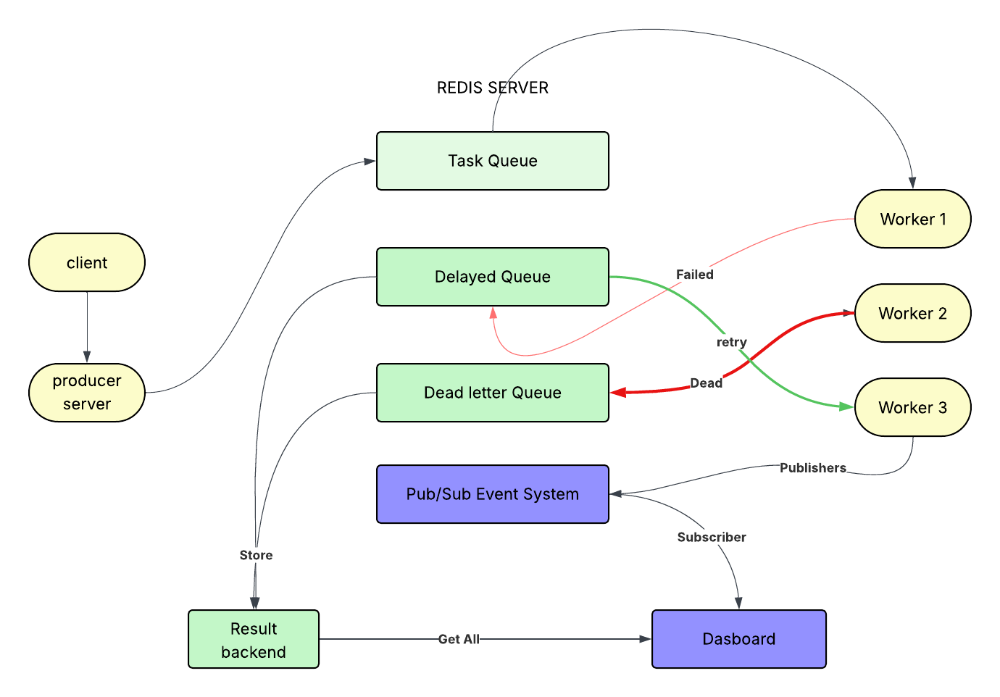
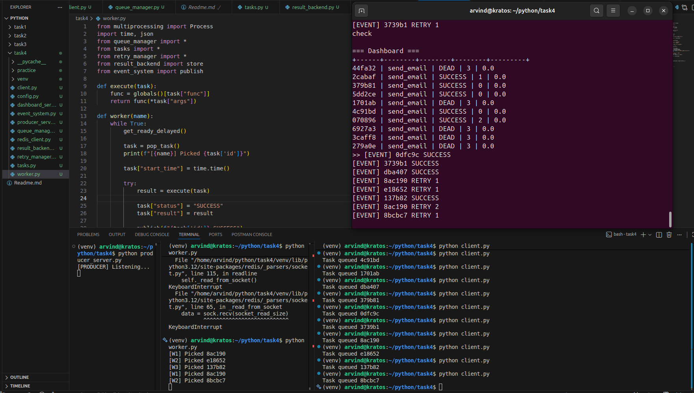

# Distributed Task Queue

A lightweight distributed task queue built with **Python**, **Redis**, and **TCP sockets**. Supports delayed retries with exponential backoff, a dead letter queue, real-time pub/sub events, and a CLI dashboard.

---

##  Features

- **Socket-based producer** — accepts task submissions over a TCP connection
- **Redis-backed queues** — main queue, delayed queue (sorted set), and dead letter queue
- **Multiprocessing workers** — concurrent task execution across N worker processes
- **Exponential backoff retries** — failed tasks are re-queued with `2^retries` second delay
- **Dead letter queue (DLQ)** — tasks exceeding `MAX_RETRIES` are moved here for inspection
- **Pub/sub event bus** — real-time status events published to a Redis channel
- **CLI dashboard** — live task status viewer with duration tracking

---

## Architecture



## Project Structure

```
pytaskq/
├── client.py           # Submit tasks via TCP socket
├── server.py           # TCP producer server — receives and enqueues tasks
├── worker.py           # Multiprocessing worker pool
├── queue_manager.py    # Redis queue operations (push, pop, delayed, DLQ)
├── tasks.py            # Registered task functions
├── retry_manager.py    # Retry logic and backoff delay calculator
├── result_backend.py   # Store and retrieve task results from Redis
├── event_system.py     # Pub/sub publish and subscribe helpers
├── redis_client.py     # Shared Redis connection
├── dashboard.py        # CLI dashboard for task monitoring
└── config.py           # Configuration constants
```

---


## Task Lifecycle

```
PENDING → (worker picks up) → executing
    ├── success  → SUCCESS  → stored in result backend
    ├── failure, retries < MAX_RETRIES → re-queued with exponential delay
    └── failure, retries == MAX_RETRIES → DEAD → moved to DLQ
```

Retry delays follow `2^retries` seconds:

| Attempt | Delay |
|---|---|
| 1st retry | 2s |
| 2nd retry | 4s |
| 3rd retry | 8s → DLQ |

---

## Events

Workers publish status events to the `events` Redis channel. The dashboard subscribes automatically. Event format:

```
<task_id> SUCCESS
<task_id> RETRY <attempt_number>
<task_id> DEAD
```

## output

